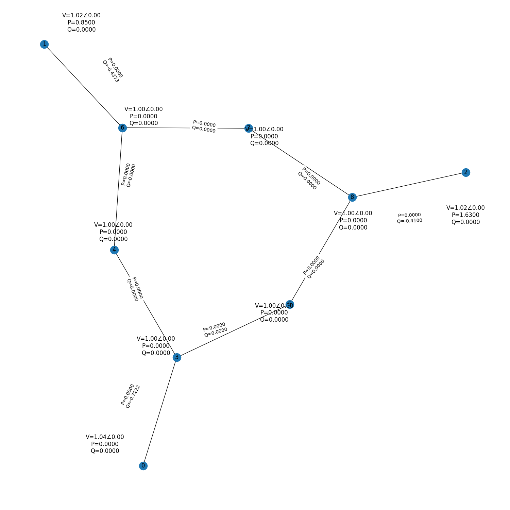

# powersys
Python package for Power System Analysis, Optimization and Dynamics

# Installation
```pip install powersys```

# Usage
## Building a Power System model using modularity
```python
import powersys as ps
from powersys.objects import *

# Construct new model
model = ps.models.PowerSystem()

# Add 3 buses
model.add(Busbar(type = model.SLACK, V = 1.00, angle = 0.0)) # Slack bus
model.add(Busbar(type = model.PV, V = 1.01, angle = 0.0, Pgen = 0.5, Qgen = 0.3)) # PV
model.add(Busbar(type = model.PQ, V = 1.00, angle = 0.0, Pload = 0.5, Qload = 0.2)) # PQ

# Add 3 lines to form a ring
model.add(Line(from_bus = 0, to_bus = 1, R = 0.1, X = 0.01))
model.add(Line(from_bus = 0, to_bus = 2, R = 0.1, X = 0.01))
model.add(Line(from_bus = 1, to_bus = 2, R = 0.1, X = 0.01))

print(model)
```

```console
PowerSystem model
Buses: 3        Lines: 3        Generators: 0
Frequency: 60   MVA-Base: 100

Busbar data:
  id    type     V    angle    Pgen    Qgen    Pload    Qload    Vmin    Vmax    Pgen_fixed    Qgen_fixed
----  ------  ----  -------  ------  ------  -------  -------  ------  ------  ------------  ------------
   0       3  1           0     0       0        0        0      0.95    1.05           0             0
   1       2  1.01        0     0.5     0.3      0        0      0.95    1.05           0.5           0.3
   2       0  1           0     0       0        0.5      0.2    0.95    1.05           0             0

Transmission line data:
  id    from_bus    to_bus    R     X  Z              B    a    mva
----  ----------  --------  ---  ----  -----------  ---  ---  -----
   0           0         1  0.1  0.01  (0.1+0.01j)    0    1    inf
   1           0         2  0.1  0.01  (0.1+0.01j)    0    1    inf
   2           1         2  0.1  0.01  (0.1+0.01j)    0    1    inf
```

## Loading Power System IEEE data
```python
import powersys as ps

ieee9 = ps.datasets.IEEE9()

model = ps.models.PowerSystem(data = ieee9)
print(model)
```

```console
PowerSystem model
Buses: 9        Lines: 9        Generators: 0
Frequency: 60   MVA-Base: 100

Busbar data:
  id    type      V    angle    Pgen    Qgen    Pload    Qload    Vmin    Vmax    Pgen_fixed    Qgen_fixed
----  ------  -----  -------  ------  ------  -------  -------  ------  ------  ------------  ------------
   0       3  1.04         0    0          0     0        0       0.95    1.05          0                0
   1       2  1.025        0    1.63       0     0        0       0.95    1.05          1.63             0
   2       2  1.025        0    0.85       0     0        0       0.95    1.05          0.85             0
   3       0  1            0    0          0     0        0       0.95    1.05          0                0
   4       0  1            0    0          0     1.25     0.5     0.95    1.05          0                0
   5       0  1            0    0          0     0.9      0.3     0.95    1.05          0                0
   6       0  1            0    0          0     0        0       0.95    1.05          0                0
   7       0  1            0    0          0     1        0.35    0.95    1.05          0                0
   8       0  1            0    0          0     0        0       0.95    1.05          0                0

Transmission line data:
  id    from_bus    to_bus       R       X  Z                     B    a    mva
----  ----------  --------  ------  ------  ----------------  -----  ---  -----
   0           0         3  0       0.0576  0.0576j           0        1    inf
   1           1         6  0       0.0625  0.0625j           0        1    inf
   2           2         8  0       0.0586  0.0586j           0        1    inf
   3           3         4  0.01    0.085   (0.01+0.085j)     0.176    1    inf
   4           3         5  0.017   0.092   (0.017+0.092j)    0.158    1    inf
   5           4         6  0.032   0.161   (0.032+0.161j)    0.306    1    inf
   6           5         8  0.039   0.17    (0.039+0.17j)     0.358    1    inf
   7           6         7  0.0085  0.072   (0.0085+0.072j)   0.149    1    inf
   8           7         8  0.0119  0.1008  (0.0119+0.1008j)  0.209    1    inf
```

## Visualize voltages and power flows in a graph
Note: This graph is not the actual Power System schematic. It is used only to make it easier for users to see voltages/currents/powers.

```python
import powersys as ps

ieee9 = ps.datasets.IEEE9()

model = ps.models.PowerSystem(data = ieee9)
model.plot()
```


## Perform AC Load Flow Analysis
Check model variables before solving
```python
import powersys as ps

# Load model
model = ps.models.PowerSystem(data = ps.datasets.IEEE9())
print(model)
```
```console
PowerSystem model
Buses: 9        Lines: 9        Generators: 0
Frequency: 60   MVA-Base: 100

Busbar data:
  id    type      V    angle    Pgen    Qgen    Pload    Qload    Vmin    Vmax    Pgen_fixed    Qgen_fixed
----  ------  -----  -------  ------  ------  -------  -------  ------  ------  ------------  ------------
   0       3  1.04         0    0          0     0        0       0.95    1.05          0                0
   1       2  1.025        0    1.63       0     0        0       0.95    1.05          1.63             0
   2       2  1.025        0    0.85       0     0        0       0.95    1.05          0.85             0
   3       0  1            0    0          0     0        0       0.95    1.05          0                0
   4       0  1            0    0          0     1.25     0.5     0.95    1.05          0                0
   5       0  1            0    0          0     0.9      0.3     0.95    1.05          0                0
   6       0  1            0    0          0     0        0       0.95    1.05          0                0
   7       0  1            0    0          0     1        0.35    0.95    1.05          0                0
   8       0  1            0    0          0     0        0       0.95    1.05          0                0

Transmission line data:
  id    from_bus    to_bus       R       X  Z                     B    a    mva
----  ----------  --------  ------  ------  ----------------  -----  ---  -----
   0           0         3  0       0.0576  0.0576j           0        1    inf
   1           1         6  0       0.0625  0.0625j           0        1    inf
   2           2         8  0       0.0586  0.0586j           0        1    inf
   3           3         4  0.01    0.085   (0.01+0.085j)     0.176    1    inf
   4           3         5  0.017   0.092   (0.017+0.092j)    0.158    1    inf
   5           4         6  0.032   0.161   (0.032+0.161j)    0.306    1    inf
   6           5         8  0.039   0.17    (0.039+0.17j)     0.358    1    inf
   7           6         7  0.0085  0.072   (0.0085+0.072j)   0.149    1    inf
   8           7         8  0.0119  0.1008  (0.0119+0.1008j)  0.209    1    inf
```

Now, solve it and display calculated variables
```python
solver = ps.solvers.LF(model)

# Solve
solver.solve(method = "newton-raphson")

# Print results
print(model)
```
```console
METHOD: newton-raphson
Load flow solved in 197 iterations!
PowerSystem model
Buses: 9        Lines: 9        Generators: 0
Frequency: 60   MVA-Base: 100

Busbar data:
  id    type         V       angle    Pgen    Qgen    Pload    Qload    Vmin    Vmax    Pgen_fixed    Qgen_fixed
----  ------  --------  ----------  ------  ------  -------  -------  ------  ------  ------------  ------------
   0       3  1.04       0               0       0     0        0       0.95    1.05          0                0
   1       2  1.025      0.161946        0       0     0        0       0.95    1.05          1.63             0
   2       2  1.025      0.0813948       0       0     0        0       0.95    1.05          0.85             0
   3       0  1.02579   -0.0386968       0       0     0        0       0.95    1.05          0                0
   4       0  0.995632  -0.0696291       0       0     1.25     0.5     0.95    1.05          0                0
   5       0  1.01266   -0.0643686       0       0     0.9      0.3     0.95    1.05          0                0
   6       0  1.02577    0.0649012       0       0     0        0       0.95    1.05          0                0
   7       0  1.01588    0.0126773       0       0     1        0.35    0.95    1.05          0                0
   8       0  1.03235    0.0343016       0       0     0        0       0.95    1.05          0                0

Transmission line data:
  id    from_bus    to_bus       R       X  Z                     B    a    mva
----  ----------  --------  ------  ------  ----------------  -----  ---  -----
   0           0         3  0       0.0576  0.0576j           0        1    inf
   1           1         6  0       0.0625  0.0625j           0        1    inf
   2           2         8  0       0.0586  0.0586j           0        1    inf
   3           3         4  0.01    0.085   (0.01+0.085j)     0.176    1    inf
   4           3         5  0.017   0.092   (0.017+0.092j)    0.158    1    inf
   5           4         6  0.032   0.161   (0.032+0.161j)    0.306    1    inf
   6           5         8  0.039   0.17    (0.039+0.17j)     0.358    1    inf
   7           6         7  0.0085  0.072   (0.0085+0.072j)   0.149    1    inf
   8           7         8  0.0119  0.1008  (0.0119+0.1008j)  0.209    1    inf
   ```